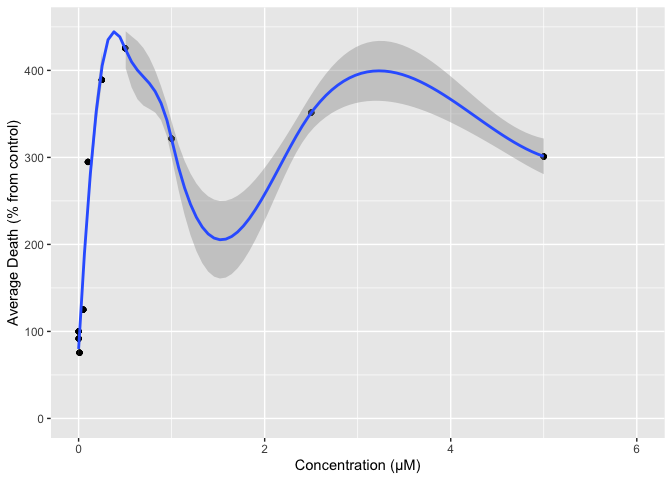
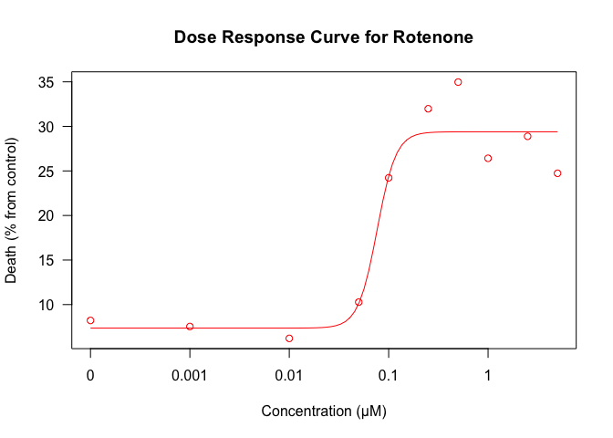

HW 1 - Curve fitting to cytotoxicity data
================
Lizbeth Gomez & Nastasia Gernat
2/9/2020

``` r
library(drc) 
```

    ## Loading required package: MASS

    ## 
    ## 'drc' has been loaded.

    ## Please cite R and 'drc' if used for a publication,

    ## for references type 'citation()' and 'citation('drc')'.

    ## 
    ## Attaching package: 'drc'

    ## The following objects are masked from 'package:stats':
    ## 
    ##     gaussian, getInitial

``` r
library(tidyverse) 
```

    ## ── Attaching packages ───────────────────────────────────────────────────── tidyverse 1.3.0 ──

    ## ✓ ggplot2 3.2.1     ✓ purrr   0.3.3
    ## ✓ tibble  2.1.3     ✓ dplyr   0.8.4
    ## ✓ tidyr   1.0.2     ✓ stringr 1.4.0
    ## ✓ readr   1.3.1     ✓ forcats 0.4.0

    ## ── Conflicts ──────────────────────────────────────────────────────── tidyverse_conflicts() ──
    ## x dplyr::filter() masks stats::filter()
    ## x dplyr::lag()    masks stats::lag()
    ## x dplyr::select() masks MASS::select()

``` r
library(dplyr)
library(janitor) 
```

    ## 
    ## Attaching package: 'janitor'

    ## The following objects are masked from 'package:stats':
    ## 
    ##     chisq.test, fisher.test

``` r
library(ggplot2)
library(readxl)
library(raster) 
```

    ## Loading required package: sp

    ## 
    ## Attaching package: 'raster'

    ## The following object is masked from 'package:janitor':
    ## 
    ##     crosstab

    ## The following object is masked from 'package:dplyr':
    ## 
    ##     select

    ## The following object is masked from 'package:tidyr':
    ## 
    ##     extract

    ## The following objects are masked from 'package:MASS':
    ## 
    ##     area, select

``` r
cyto_death = read_xlsx("data/cytotox_data.xlsx") %>%
  clean_names() 

summary(cyto_death)
```

    ##  concentration        rep_1            rep_2            rep_3       
    ##  Min.   :0.0000   Min.   : 1.457   Min.   : 4.959   Min.   : 6.819  
    ##  1st Qu.:0.0200   1st Qu.: 6.322   1st Qu.: 9.437   1st Qu.:16.693  
    ##  Median :0.1750   Median :22.739   Median :24.584   Median :26.319  
    ##  Mean   :0.9411   Mean   :17.850   Mean   :21.174   Mean   :22.690  
    ##  3rd Qu.:0.8750   3rd Qu.:25.049   3rd Qu.:30.043   3rd Qu.:28.091  
    ##  Max.   :5.0000   Max.   :32.960   Max.   :39.766   Max.   :35.285  
    ##      rep_4            rep_5            rep_6        avg_cell_death  
    ##  Min.   : 4.182   Min.   : 2.779   Min.   : 2.729   Min.   : 6.204  
    ##  1st Qu.: 6.522   1st Qu.:12.731   1st Qu.: 8.121   1st Qu.: 8.733  
    ##  Median :26.014   Median :21.094   Median :17.799   Median :24.481  
    ##  Mean   :20.353   Mean   :20.273   Mean   :19.731   Mean   :20.345  
    ##  3rd Qu.:29.160   3rd Qu.:28.153   3rd Qu.:27.656   3rd Qu.:28.268  
    ##  Max.   :40.276   Max.   :38.021   Max.   :44.000   Max.   :34.972  
    ##     from_ctr     
    ##  Min.   : 75.49  
    ##  1st Qu.:106.26  
    ##  Median :297.88  
    ##  Mean   :247.55  
    ##  3rd Qu.:343.95  
    ##  Max.   :425.52

``` r
cyto_tidy_death = 
  pivot_longer(
    cyto_death, 
    rep_1:rep_6,
    names_to = "replicates", 
    values_to = "rep")

summary(cyto_tidy_death)
```

    ##  concentration    avg_cell_death      from_ctr       replicates       
    ##  Min.   :0.0000   Min.   : 6.204   Min.   : 75.49   Length:60         
    ##  1st Qu.:0.0100   1st Qu.: 8.219   1st Qu.:100.00   Class :character  
    ##  Median :0.1750   Median :24.481   Median :297.88   Mode  :character  
    ##  Mean   :0.9411   Mean   :20.345   Mean   :247.55                     
    ##  3rd Qu.:1.0000   3rd Qu.:28.884   3rd Qu.:351.45                     
    ##  Max.   :5.0000   Max.   :34.972   Max.   :425.52                     
    ##       rep        
    ##  Min.   : 1.457  
    ##  1st Qu.: 9.117  
    ##  Median :22.648  
    ##  Mean   :20.345  
    ##  3rd Qu.:28.666  
    ##  Max.   :44.000

``` r
cyto_death_plot <- cyto_tidy_death %>% 
  ggplot(aes(x = concentration, y = rep)) +
  ylim(0, 45) + xlim(0,6) +
  geom_point(aes(color = replicates)) +
  geom_smooth(method= "auto", se= TRUE) 
cyto_death_plot
```

    ## `geom_smooth()` using method = 'loess' and formula 'y ~ x'

<!-- -->

``` r
#Absolute percent cell death per concentration by replication

cyto_death_plot_2 <- cyto_tidy_death %>% 
  ggplot(aes(x = concentration, y = avg_cell_death)) +
  ylim(0, 45) + xlim(0,6) +
  geom_point() +
  geom_smooth(method= "auto", se= TRUE) 
cyto_death_plot_2
```

    ## `geom_smooth()` using method = 'loess' and formula 'y ~ x'

<!-- -->

``` r
#Calculation of percent death from control
cyto_death_plot_3 <- cyto_tidy_death %>% 
  ggplot(aes(x = concentration, y = from_ctr)) +
  ylim(0, 450) + xlim(0,6) +
  geom_point() +
  geom_smooth(method= "auto", se= TRUE) 
cyto_death_plot_3
```

    ## `geom_smooth()` using method = 'loess' and formula 'y ~ x'

<!-- -->

``` r
cv_mean <- cyto_tidy_death %>%
 group_by(concentration)%>%
  summarise(mean = mean(rep), 
            cv = cv(rep)) %>%
 knitr::kable()
  cv_mean
```

| concentration |      mean |       cv |
| ------------: | --------: | -------: |
|         0.000 |  8.218574 | 72.75949 |
|         0.001 |  7.537044 | 77.25855 |
|         0.010 |  6.204400 | 82.65797 |
|         0.050 | 10.275707 | 36.46630 |
|         0.100 | 24.226595 | 24.12076 |
|         0.250 | 31.977673 | 15.89939 |
|         0.500 | 34.971719 | 21.06594 |
|         1.000 | 26.418933 | 16.30543 |
|         2.500 | 28.884271 | 21.96060 |
|         5.000 | 24.735796 | 14.80658 |

``` r
regress_cyto<- drm(avg_cell_death ~concentration, data = cyto_tidy_death, fct = LL.4(names = c("Slope","Lower Limit", "Upper Limit", "AC50" )))


summary(regress_cyto)
```

    ## 
    ## Model fitted: Log-logistic (ED50 as parameter) (4 parms)
    ## 
    ## Parameter estimates:
    ## 
    ##                           Estimate Std. Error t-value   p-value    
    ## Slope:(Intercept)       -4.5811715  0.7947123 -5.7646 3.660e-07 ***
    ## Lower Limit:(Intercept)  7.3587678  0.6522872 11.2815 4.638e-16 ***
    ## Upper Limit:(Intercept) 29.3922745  0.5076047 57.9039 < 2.2e-16 ***
    ## AC50:(Intercept)         0.0764826  0.0049467 15.4612 < 2.2e-16 ***
    ## ---
    ## Signif. codes:  0 '***' 0.001 '**' 0.01 '*' 0.05 '.' 0.1 ' ' 1
    ## 
    ## Residual standard error:
    ## 
    ##  2.764221 (56 degrees of freedom)

``` r
#Compute 95% CI for my IC50
ED(regress_cyto, 50, interval = "delta")%>%
 knitr::kable()
```

    ## 
    ## Estimated effective doses
    ## 
    ##         Estimate Std. Error     Lower     Upper
    ## e:1:50 0.0764826  0.0049467 0.0665731 0.0863921

|        |  Estimate | Std. Error |     Lower |     Upper |
| ------ | --------: | ---------: | --------: | --------: |
| e:1:50 | 0.0764826 |  0.0049467 | 0.0665731 | 0.0863921 |

``` r
plot(regress_cyto, xlab = "Concentration (μM)", ylab = "Death (% from control)", col = "red", main = "Dose Response Curve for Rotenone")
```

<!-- -->

``` r
 modelFit(regress_cyto)
```

    ## Lack-of-fit test
    ## 
    ##           ModelDf    RSS Df    F value    p value
    ## ANOVA          50   0.00                         
    ## DRC model      56 427.89  6 3.7923e+29 0.0000e+00
